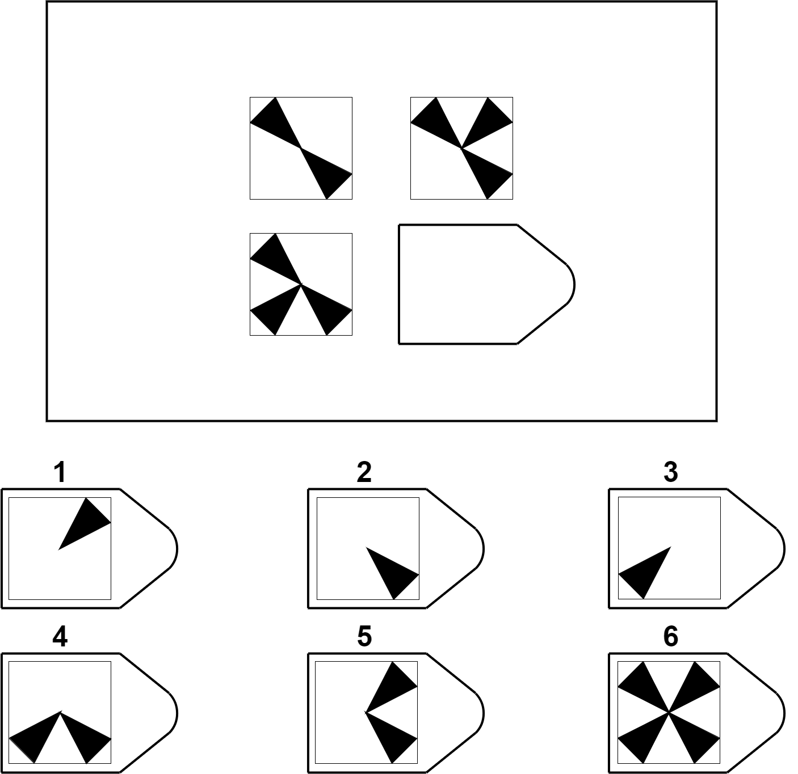
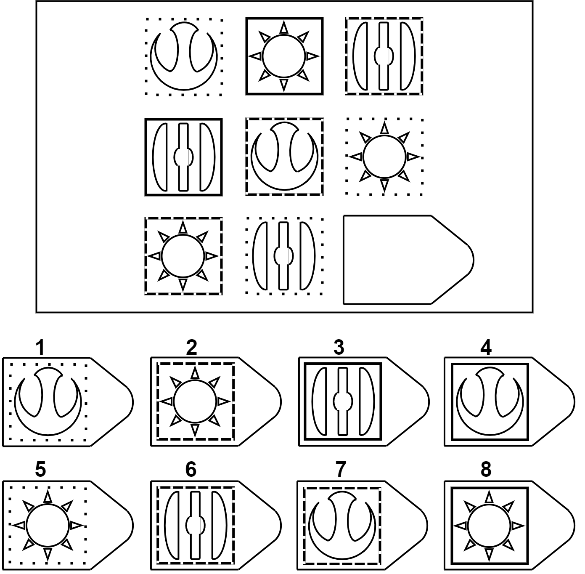

# Computational Models for Solving Raven's Progressive Matrices Using Analogies and Image Transformations

This repository contains the source code for the ACS 2020 paper **Computational Models for Solving Raven's Progressive Matrices Using Analogies and Image Transformations**.

## 1. Requirements
* `Python 3.7` is used for this project.
* Package dependencies reside in `requirements.txt`.

## 2. Project Structure
* **Main entry** is `main.py`. It has six lines of code invoking the six strategies we mentioned in our paper to solve RPM problems.
* **Inputs**  are (1) the images of RPM problems in folder `problems/SPMpadded`, (2) the coordinates to segment each problem image into matrix entries and options in file `problems/SPM coordinates.txt`, and (3) the correct answers to each problem in file `problems/stuff.txt`.
* **Outputs** are reports in folder `reports`. Every time you run the code, it will generate new time-stamped reports in this folder. The report file is named `<strategy>_<score_to_maximize>_<time stamp>.xlsx`.
* **Detailed Results** are in the folder `data`. For each strategy, each type of score to maximize and each problem, there are 3 files `<strategy>_<score_to_maximize>_<problem>.json`, `<strategy>_<score_to_maximize>_<problem>_prediction.png` and `<strategy>_<score_to_maximize>_<problem>_selection.png`, which are detailed computational info, predicted image and the selected option. Every time you run the code, the previous results are overwritten.
* **Similarity Values** are pre-computed and stored in the folder `precomputated-similarities` because it takes one or two days to compute all the similarity values.

## 3. Example Problems

